# Controlador VGA con Reloj Digital

**EL3313 — Taller de Diseño Digital | I Semestre 2026**  
**Plataforma:** Nexys A7 (Artix-7) | **Resolución:** 640×480 @ 60 Hz | **Reloj:** 100 MHz

---


## Integrantes

- Nicole Irina Corrales Rodríguez
- Gerson Adrián Cordero Zúñiga
- Keilin Tatiana Loásiga Téllez

## Repositorio

**Repositorio público del proyecto:**  
[https://github.com/Geco2205/VGA-CLOCK](https://github.com/Geco2205/VGA-CLOCK)

---

## Diagrama de Bloques del Sistema

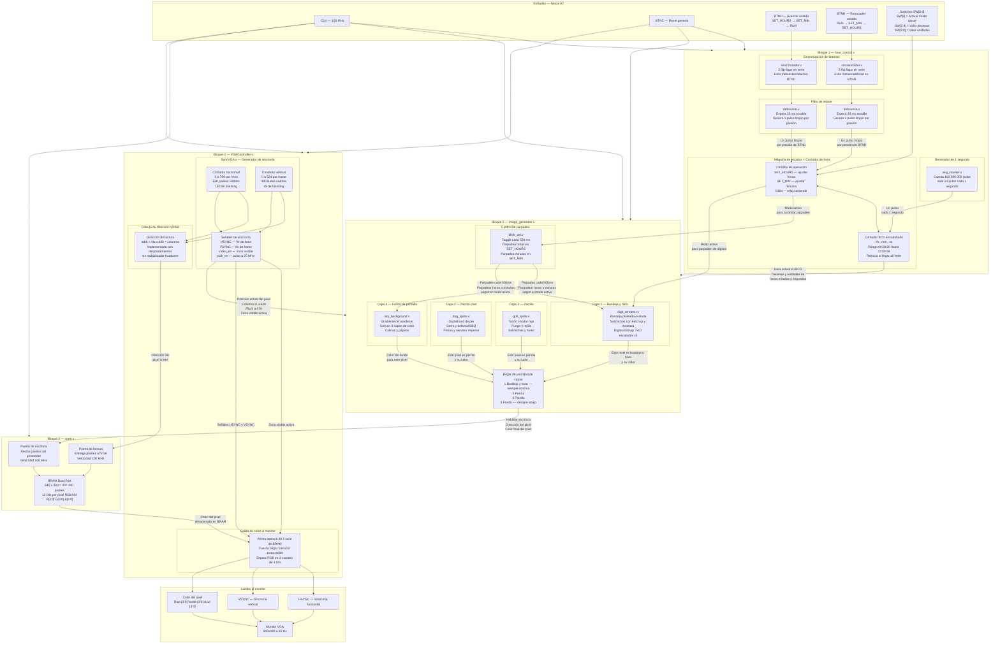

---

## Descripción de Módulos

### Bloque 1 — `hour_control.v`

Mantiene y gestiona la hora actual del reloj digital.

| Sub-módulo | Función |
|---|---|
| `sincronizador.v` (×2) | Doble flip-flop para evitar metaestabilidad en `btn_c` y `btn_r` |
| `debounce.v` (×2) | Filtra rebotes mecánicos — 20 ms @ 100 MHz |
| `seg_counter.v` | Genera un pulso de 1 Hz contando 100 000 000 ciclos |
| FSM interna | 3 estados: `SET_HOURS`, `SET_MIN`, `RUN` |
| Contador BCD | Cuenta `hh:mm:ss` de 00:00:00 a 23:59:59 con carry encadenado |

**Interfaz de usuario:**

- `SW[8]` → activa modo ajuste
- `SW[7:4]` → decenas del campo seleccionado
- `SW[3:0]` → unidades del campo seleccionado
- `BTNU` → avanza estado
- `BTNR` → retrocede estado

---

### Bloque 2 — `image_generator.v`

Genera el contenido visual píxel a píxel y lo escribe en la VRAM. Este bloque compone cuatro capas visuales principales y selecciona el color final del píxel según prioridad.

| Sub-módulo | Capa | Contenido |
|---|---|---|
| `digit_renderer.v` | 1 — mayor prioridad | Bandeja plateada, salchichas y hora BCD en bitmap |
| `dog_sprite.v` | 2 | Dachshund de pie con gorro, delantal BBQ, pinzas y cerveza Imperial |
| `grill_sprite.v` | 3 | Parrilla circular con fuego, rejilla y salchichas |
| `sky_background.v` | 4 — menor prioridad | Gradiente de atardecer con sol, colinas y pájaros |
| `blink_ctrl.v` | — | Señales de parpadeo para modo ajuste y efectos visuales |

**Regla de composición:**

```text
pixel final = bandeja u hora activa  →  color de bandeja u hora
            = perrito activo         →  color del perrito
            = parrilla activa        →  color de la parrilla
            = ninguno                →  color del fondo
```

El módulo genera las señales de escritura hacia la memoria de video:

| Señal | Función |
|---|---|
| `wr_en` | Habilita la escritura de un píxel en VRAM |
| `wr_addr` | Dirección lineal del píxel dentro del framebuffer |
| `wr_data` | Color final del píxel en formato RGB444 |

La dirección de escritura se calcula a partir de la posición del píxel:

```text
wr_addr = y × 640 + x
```

---

### Bloque 3 — `vram.v`

Memoria de video de doble puerto implementada como framebuffer del sistema VGA.

| Parámetro | Valor |
|---|---|
| Resolución | 640 × 480 = 307 200 posiciones |
| Ancho de dato | 12 bits — formato RGB444 |
| Ancho de dirección | 19 bits |
| Puerto escritura | 100 MHz — desde `image_generator.v` |
| Puerto lectura | 100 MHz — desde `VGAController.v` |

La VRAM permite separar la generación de imagen del proceso de visualización VGA.  
El generador de imagen escribe el contenido visual en memoria, mientras que el controlador VGA lee los datos siguiendo el barrido de pantalla.

---

### Bloque 4 — `VGAController.v`

Genera las señales VGA estándar 640×480 @ 60 Hz y lee la VRAM para obtener el color de cada píxel.

| Sub-módulo | Función |
|---|---|
| `SyncVGA.v` | Contadores horizontal y vertical; genera `HSYNC`, `VSYNC`, `video_en` y `pclk_en` |
| Generador de dirección | Calcula `addr = fila × 640 + columna` usando desplazamientos |
| Lógica de salida RGB | Alinea latencia de BRAM y fuerza negro fuera de zona visible |

**Temporización VGA 640×480 @ 60 Hz:**

```text
Horizontal: 640 visible | 16 FP | 96 sync | 48 BP  = 800 total
Vertical:   480 visible | 10 FP |  2 sync | 33 BP  = 525 total
Pixel clock: 100 MHz dividido entre 4 = 25 MHz
```

---

## Jerarquía de Módulos

```text
top.v
├── hour_control.v              ← Bloque 1
│   ├── sincronizador.v  (×2)
│   ├── debounce.v       (×2)
│   └── seg_counter.v
├── image_generator.v           ← Bloque 2
│   ├── blink_ctrl.v
│   ├── sky_background.v
│   ├── grill_sprite.v
│   ├── dog_sprite.v
│   └── digit_renderer.v
├── vram.v                      ← Bloque 3
└── VGAController.v             ← Bloque 4
    └── SyncVGA.v
```

---

## Evidencia de uso de inteligencia artificial

Durante el desarrollo del proyecto se utilizó inteligencia artificial como herramienta de apoyo para comprender conceptos, analizar alternativas de implementación, revisar módulos Verilog, generar explicaciones técnicas y documentar el funcionamiento de la generación de imagen y la VRAM.

La inteligencia artificial se utilizó como apoyo durante el proceso de diseño, documentación y validación conceptual. La integración, pruebas y verificación del funcionamiento en FPGA fueron realizadas dentro del desarrollo del proyecto.

### Conversaciones compartidas utilizadas

- [Conversación en Claude — apoyo técnico 1](https://claude.ai/share/df3a9d99-df0a-4e0a-9dfb-02739b5cf39e)
- [Conversación en Claude — apoyo técnico 2](https://claude.ai/share/a87040c6-7a55-4622-a60e-3578bf6a88ee)

### Capturas de prompts utilizados

Las siguientes capturas muestran evidencia del uso de IA durante el proceso de consulta, análisis y documentación del proyecto.

<details>
<summary>Ver capturas de prompts de IA</summary>

#### Captura 1
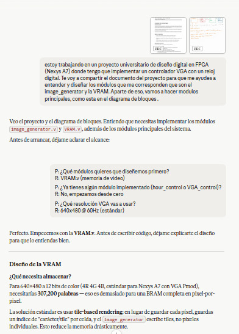

#### Captura 2
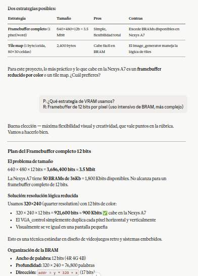

#### Captura 3
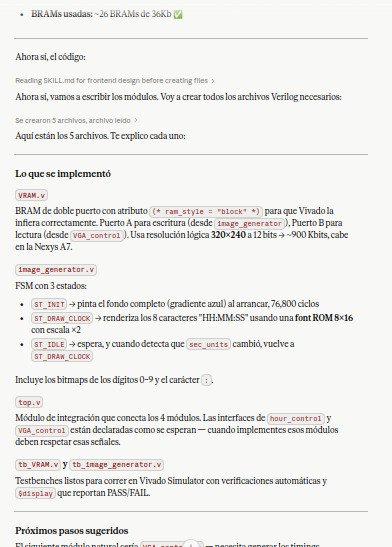

#### Captura 4
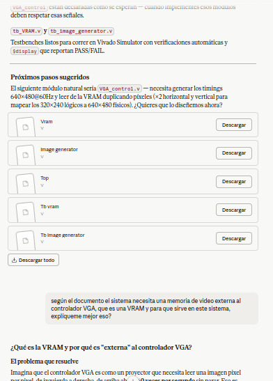

#### Captura 5
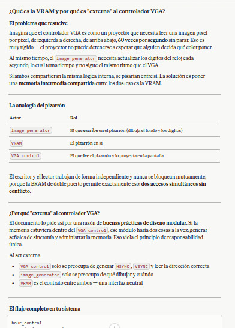

#### Captura 6
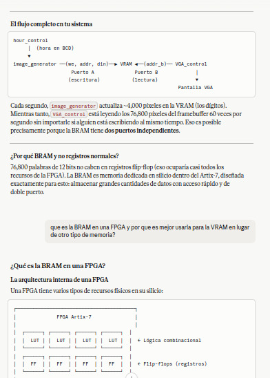

#### Captura 7
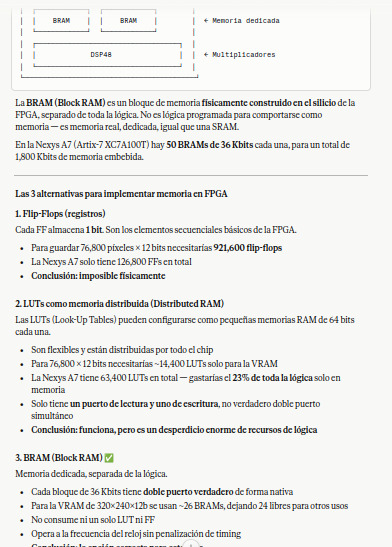

#### Captura 8
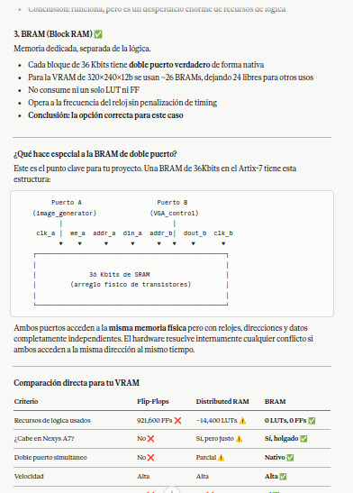

#### Captura 9
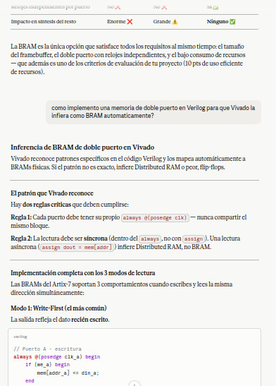

#### Captura 10
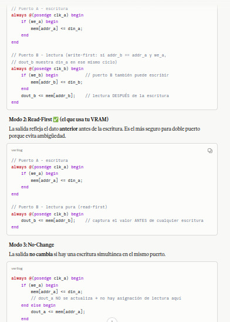

#### Captura 11
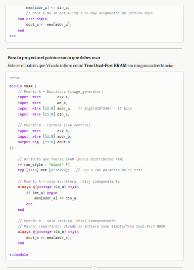

#### Captura 12
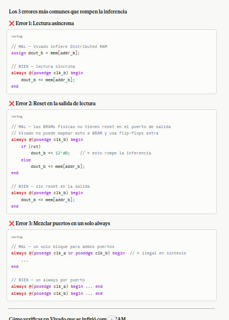

#### Captura 13
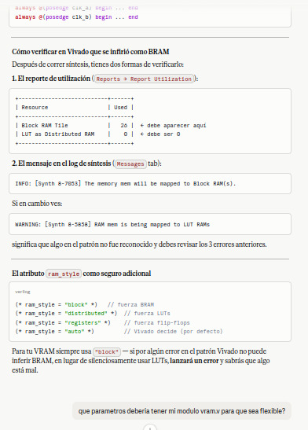

#### Captura 14
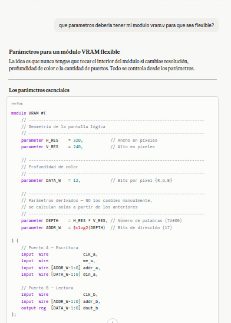

#### Captura 15
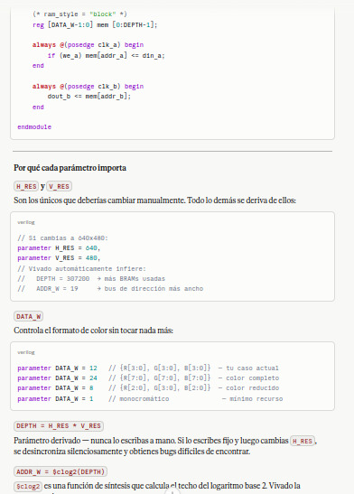

#### Captura 16
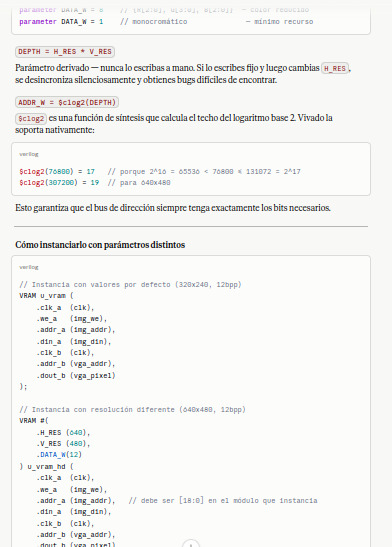

#### Captura 17
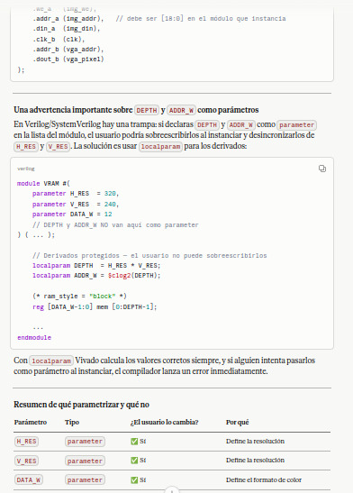

#### Captura 18
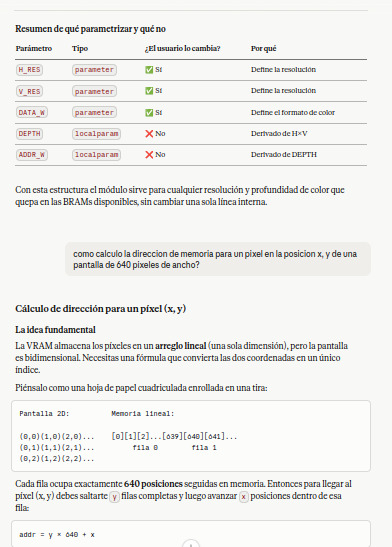

#### Captura 19
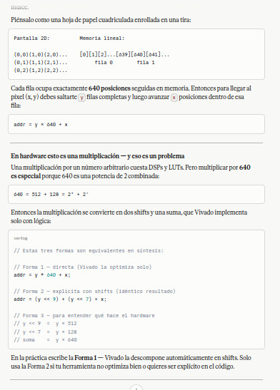

#### Captura 20
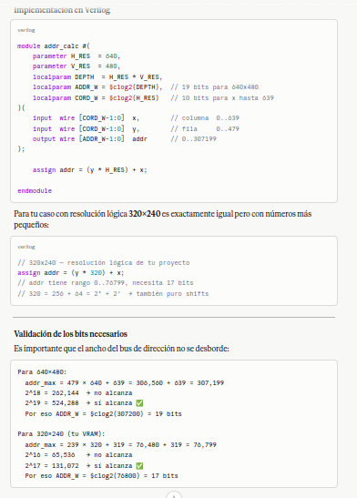

#### Captura 21
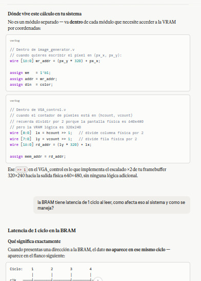

#### Captura 22
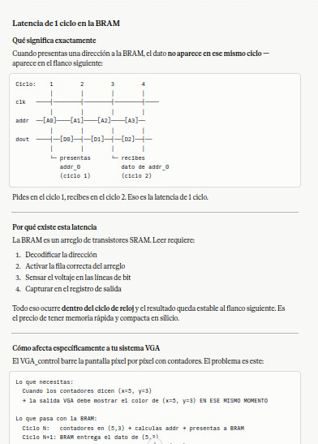

#### Captura 23
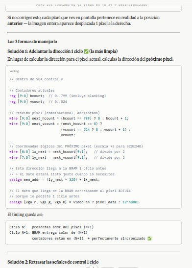

#### Captura 24
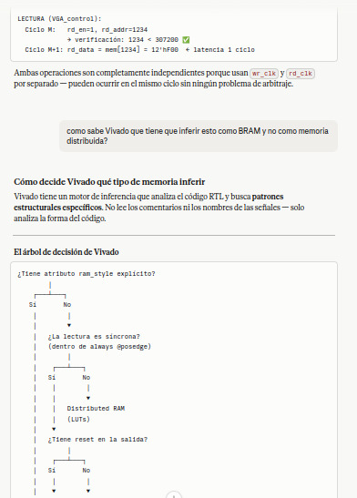

#### Captura 25
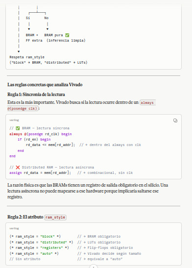

#### Captura 26
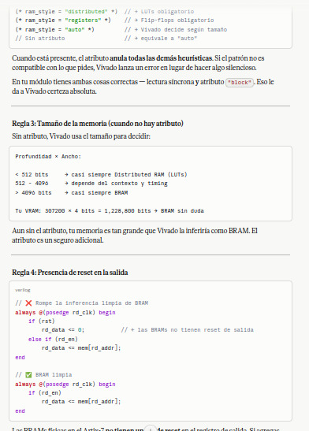

#### Captura 27
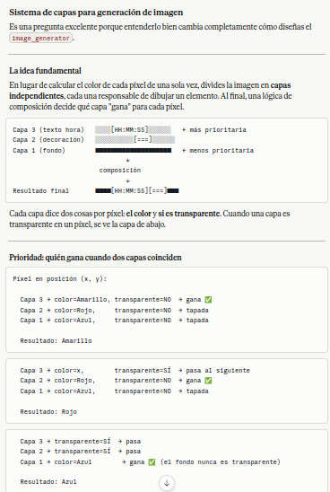

#### Captura 28
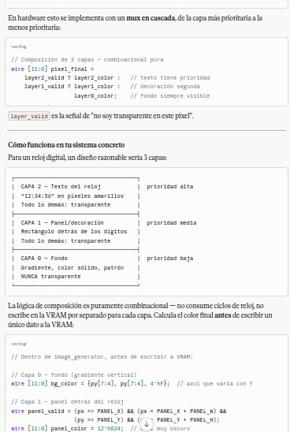

#### Captura 29
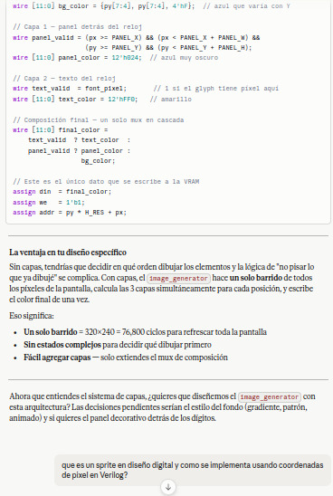

#### Captura 30
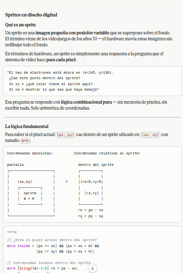

#### Captura 31
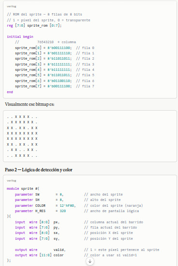

#### Captura 32
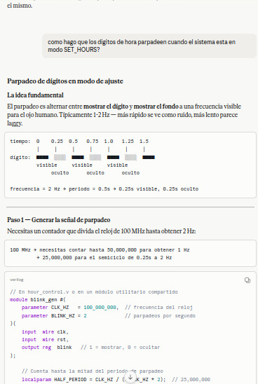

#### Captura 33
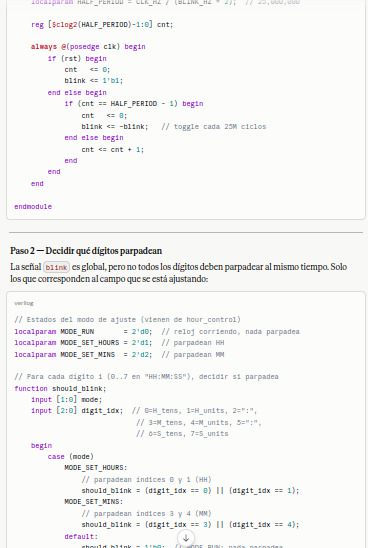

#### Captura 34
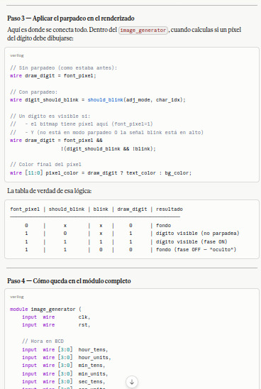

#### Captura 35
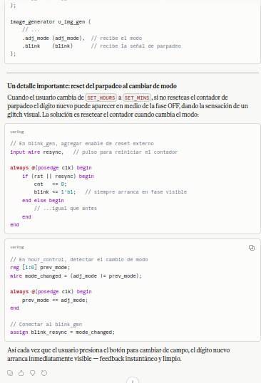

</details>

---

## Consideraciones de diseño

- El sistema se diseñó de forma modular, separando control de hora, generación visual, memoria de video y controlador VGA.
- La VRAM funciona como framebuffer, permitiendo desacoplar la escritura de imagen de la lectura VGA.
- La generación visual se realiza mediante capas con prioridad, lo que facilita integrar fondo, sprites y hora digital.
- Los datos de color se manejan en formato RGB444, compatible con las salidas VGA de 4 bits por canal.
- La documentación en código fue elaborada con comentarios técnicos siguiendo un estilo compatible con documentación HDL.

---

## Proyecto

**Curso:** EL3313 — Taller de Diseño Digital  
**Periodo:** I Semestre 2026  
**Plataforma:** Nexys A7  
**Lenguaje:** Verilog HDL  

---
